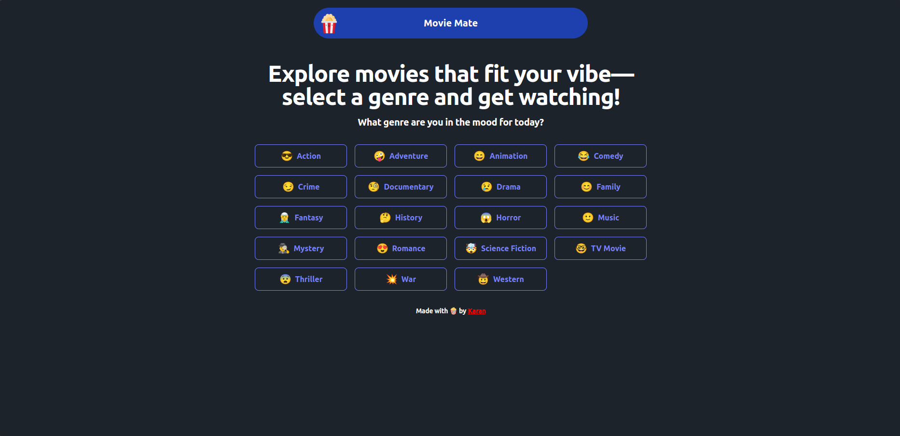
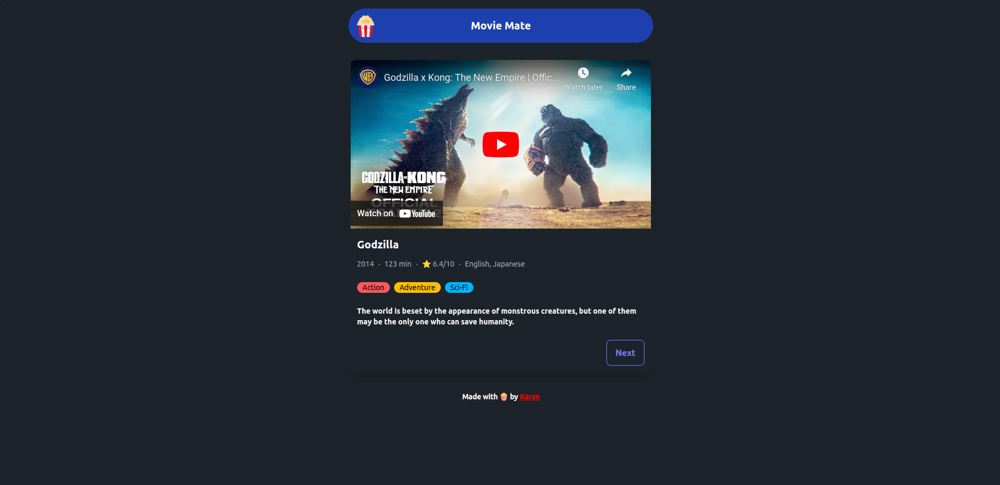

# Movie Mate

Movie Mate is a genre-based movie recommendation website built using the MERN stack (MongoDB, Express.js, React, Node.js) and styled with Tailwind CSS and Daisy UI. This web application offers a user-friendly interface with efficient filtering options, utilizing RESTful APIs for seamless interaction and real-time data integration. Features include dynamic movie details, ratings, and personalized recommendations, all enhanced by a responsive design.

## Snapshots

### Home Page


### Movie Details


## Features

- **Genre-based Filtering:** Easily filter movies by genres to find what suits your mood.
- **Dynamic Movie Details:** View comprehensive details about each movie, including ratings and descriptions.
- **Personalized Recommendations:** Get personalized movie recommendations based on your preferences.
- **Responsive Design:** Enjoy a seamless experience on any device, thanks to responsive design.
- **Movie Trailers:** Watch trailers directly from the app, integrated with YouTube API.

## Tech Stack

- **Frontend:** React, Tailwind CSS, Daisy UI
- **Backend:** Node.js, Express.js
- **Database:** MongoDB
- **APIs:** Movie Database API for movie details, YouTube API for trailers

## Installation

1. **Clone the repository:**

    ```sh
    git clone https://github.com/yourusername/movie-mate.git
    cd movie-mate
    ```

2. **Install dependencies:**

    ```sh
    # For backend
    cd backend
    npm install
    
    # For frontend
    cd ../frontend
    npm install
    ```

3. **Set up environment variables:**

    Create a `.env` file in the `backend` directory and add your API keys and other necessary configurations.

    ```sh
    MOVIE_DATABASE_API_KEY=your_movie_database_api_key
    YOUTUBE_API_KEY=your_youtube_api_key
    MONGO_URI=your_mongodb_uri
    ```

4. **Run the application:**

    ```sh
    # Start backend server
    cd backend
    npm start
    
    # Start frontend development server
    cd ../frontend
    npm run dev
    ```

    The application will be accessible at `http://localhost:3000`.

## Usage

- **Browse Movies:** Explore movies by genres and view detailed information.
- **Watch Trailers:** Click on the trailer button to watch the movie trailer.
- **Get Recommendations:** Receive movie recommendations based on your viewing history and preferences.

## Contact

If you have any questions or suggestions, feel free to reach out:

- Email: [hello@thekaranpatel.com](mailto:hello@thekaranpatel.com)
- GitHub: [karan-patel28](https://github.com/karan-patel28)
- LinkedIn: [karan-patel28](https://www.linkedin.com/in/karan-patel28)

---

Thank you for checking out Movie Mate! We hope you enjoy using it as much as we enjoyed building it.
